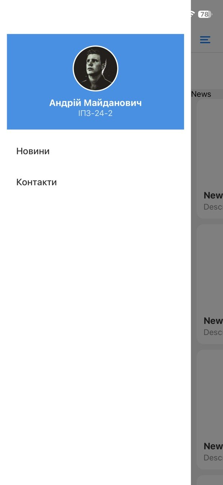
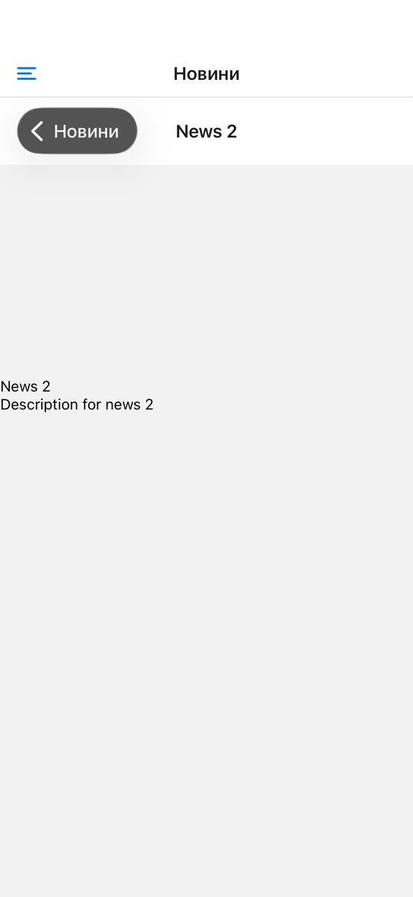
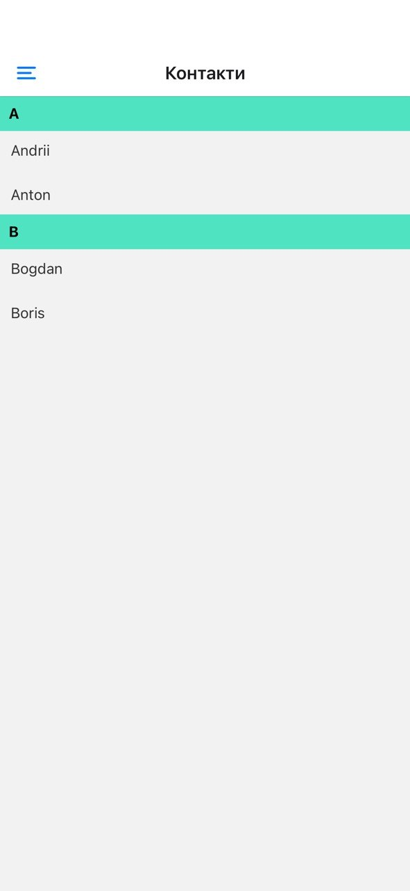
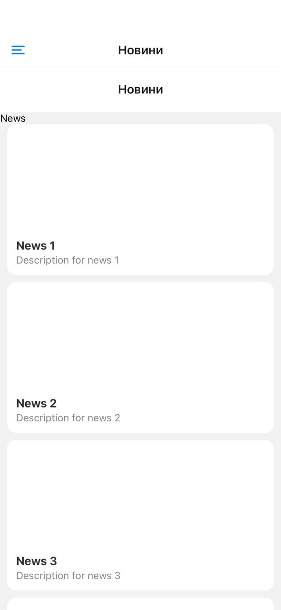

# 📱 Лабораторна робота №2

## Вкладена навігація та оптимізація списків у React Native

---

## 🔧 Інструкція запуску

1. Встановити залежності:

```
npm install
```

2. Запустити проєкт:

```
npx expo start
```

3. Відкрити:

* через Expo Go (на телефоні)
* або емулятор Android/iOS

---

## 📌 Опис реалізованого функціоналу

### 🔹 Навігація

У проєкті реалізовано вкладену навігацію:

* **Drawer Navigator** — бокове меню
* **Stack Navigator** — вкладена навігація для екрану новин

Структура:

* Новини → список → деталі
* Контакти → окремий екран

Реалізовано:

* перехід між екранами
* передача параметрів
* динамічний заголовок екрану деталей
* кастомне Drawer-меню (аватар, ПІБ, група)

---

### 🔹 Список новин (FlatList)

Реалізовано:

* **Pull-to-Refresh** (оновлення списку)
* **Infinite Scroll** (підвантаження даних)
* **ListHeaderComponent**
* **ListFooterComponent**
* **ItemSeparatorComponent**

Оптимізація:

* initialNumToRender
* maxToRenderPerBatch
* windowSize

---

### 🔹 Модель даних

Використано згенеровані тестові дані, які містять:

* `id`
* `title`
* `description`
* `image`

---

### 🔹 Контакти (SectionList)

Реалізовано:

* групування контактів за літерами
* заголовки секцій
* розділення елементів

---

### 🔹 Кастомне меню

Drawer містить:

* аватар користувача
* ПІБ
* групу
* навігацію між екранами

---

## 📸 Скріншоти


---

---

---

---

## 📚 Висновки (контрольні запитання)

### 1. Чим відрізняється FlatList від ScrollView?

FlatList використовує віртуалізацію та рендерить лише видимі елементи, що робить його більш продуктивним при роботі з великими списками. ScrollView рендерить всі елементи одразу, що може призводити до перевантаження пам’яті.

---

### 2. Що таке віртуалізація списків?

Віртуалізація — це механізм, при якому на екрані відображаються тільки ті елементи, які знаходяться у видимій області. Інші елементи не рендеряться, що значно підвищує продуктивність.

---

### 3. Як здійснюється передача параметрів між екранами?

Передача параметрів здійснюється під час навігації:

```
router.push({ pathname: "/(news)/details", params: item })
```

Отримання:

```
useLocalSearchParams()
```

---

### 4. Що таке вкладена навігація?

Вкладена навігація — це структура, в якій один навігатор міститься всередині іншого (наприклад, Stack всередині Drawer). Це дозволяє створювати складні маршрути в додатку.

---

### 5. У яких випадках застосовується SectionList?

SectionList використовується тоді, коли потрібно відобразити дані, згруповані за певною ознакою (наприклад, контакти за алфавітом).

---

## 📌 Висновок

У ході виконання лабораторної роботи було освоєно принципи побудови навігації у React Native, реалізовано вкладену навігацію та оптимізоване відображення великих списків із використанням FlatList та SectionList. Отримані знання дозволяють створювати продуктивні та зручні мобільні застосунки.
