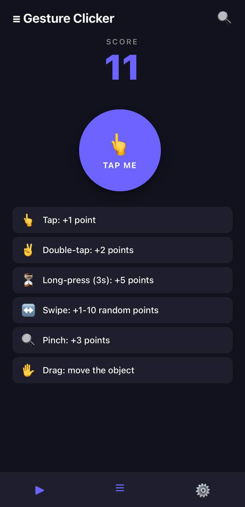
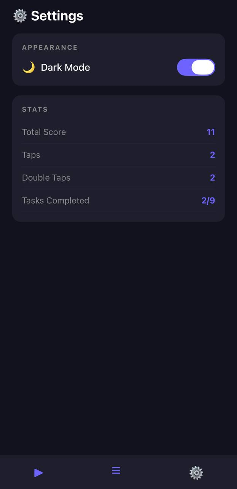
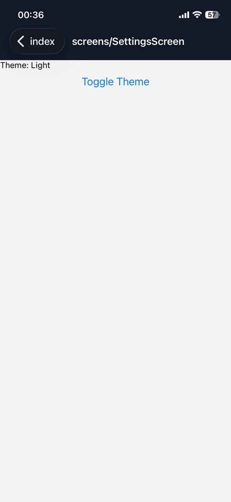

# Lab 3 — Gesture Clicker (React Native)

## Інструкція запуску

```bash
git clone https://github.com/MobileLabsRN2026/lab3
cd lab3
npm install
npx expo start
```

Відкрийте в Expo Go на телефоні або в емуляторі (рекомендується фізичний пристрій для жестів).

## Залежності

```bash
npm install zustand
npm install react-native-gesture-handler
npx expo install expo-router
```

У `babel.config.js` переконайтесь що є `expo-router/babel`:
```js
module.exports = function(api) {
  api.cache(true);
  return { presets: ['babel-preset-expo'] };
};
```

## Реалізований функціонал

### Головний екран
- Лічильник очок (SCORE)
- Один об'єкт-клікер у центрі екрану що реагує на всі жести
- Список підказок по жестах з нарахуванням очок

### Жести
| Жест | Результат |
|------|-----------|
| **Tap** (TapGestureHandler) | +1 очко |
| **Double Tap** (TapGestureHandler, numberOfTaps=2) | +2 очки |
| **Long Press 3s** (LongPressGestureHandler) | +5 очок |
| **Drag** (PanGestureHandler) | Переміщення об'єкта |
| **Swipe Right** (FlingGestureHandler) | +1-10 випадкових очок |
| **Swipe Left** (FlingGestureHandler) | +1-10 випадкових очок |
| **Pinch** (PinchGestureHandler) | +3 очки, масштабування |

### Сторінка завдань (Challenges)
- 9 завдань із прогрес-барами
- Статус виконання (✓ / кружечок)
- Загальний прогрес вгорі

### Сторінка налаштувань (Settings)
- Перемикач теми (темна/світла)
- Статистика: score, taps, double taps, виконані завдання

### Навігація
- expo-router (файлова маршрутизація)
- Нижня панель навігації на кожному екрані

### Стилізація
- Ручна StyleSheet стилізація (без NativeWind для максимальної сумісності)
- Підтримка темної та світлої теми через Zustand store (`isDark`)
- Анімації через React Native `Animated` API (bounce при double tap, flash при tap, scale при long press)

## 📸 Скріншоти

---

---

---

---
## Висновки

У лабораторній роботі реалізовано мобільний застосунок-клікер з повноцінною жестовою взаємодією. Використано всі 6 типів жестів з бібліотеки `react-native-gesture-handler`. Глобальний стан керується через `zustand`, що забезпечує синхронізацію між екранами. Реалізовано підтримку темної та світлої теми, анімований об'єкт-клікер та сторінку відстеження прогресу завдань.