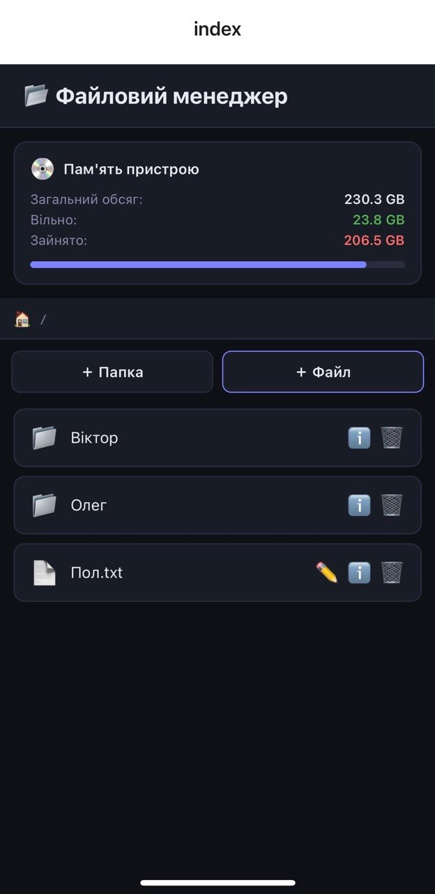
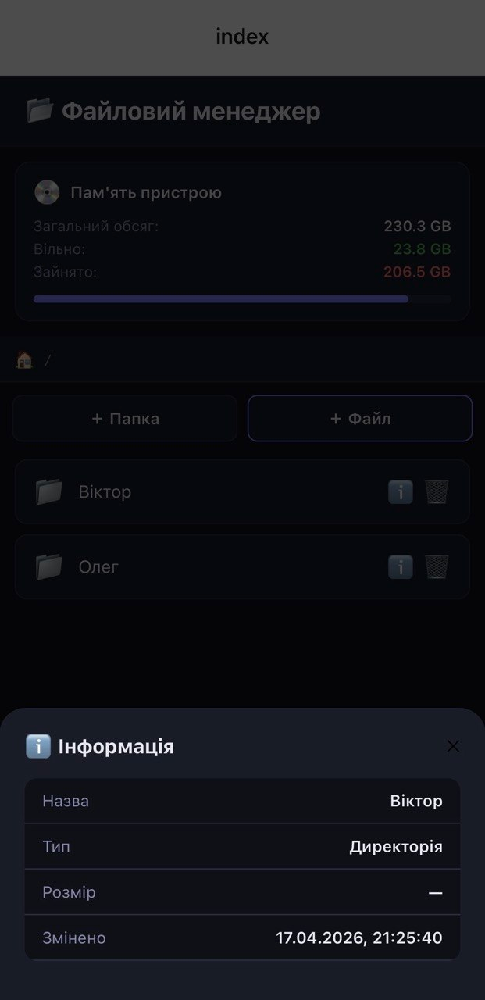
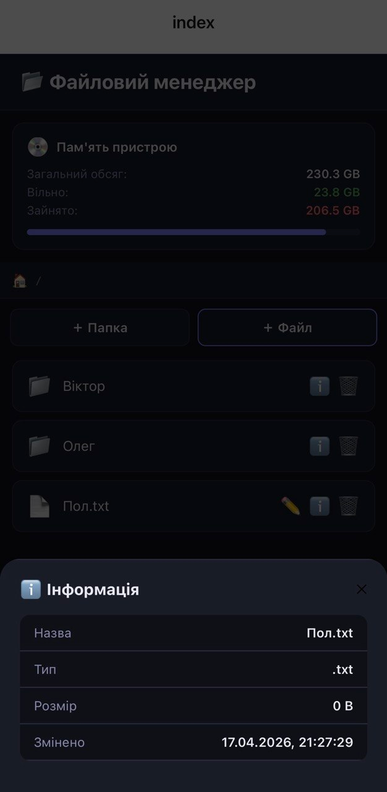

# 📂 Лабораторна робота №4 — Файловий менеджер

> **Тема:** Робота з файловою системою в React Native з використанням бібліотеки `expo-file-system`

---

## 🚀 Інструкція запуску

### Вимоги

- [Node.js](https://nodejs.org/) v18+
- [Expo Go](https://expo.dev/client) на мобільному пристрої (або емулятор Android/iOS)

### Кроки

```bash
# 1. Клонувати репозиторій
git clone https://github.com/MobileLabsRN2026/lab4.git
cd lab4

# 2. Встановити залежності
npm install

# 3. Встановити expo-file-system (якщо не встановлено)
npx expo install expo-file-system

# 4. Запустити проєкт
npx expo start
```

Після запуску відскануйте QR-код через **Expo Go** або запустіть на емуляторі натиснувши `a` (Android) або `i` (iOS) у терміналі.

---

## ✅ Реалізований функціонал

### 1. 🗂️ Навігація по файловій системі
- Відображення поточного шляху у вигляді рядка навігації (breadcrumb)
- Перегляд вмісту поточної директорії — файли та папки у відсортованому вигляді (спочатку папки)
- Перехід у вкладені директорії натисканням на папку
- Кнопка **«Назад»** для повернення до попередньої директорії

### 2. ➕ Створення
- **Нова папка** — введення назви через модальне вікно, створення через `FileSystem.makeDirectoryAsync`
- **Новий файл** — введення назви та початкового вмісту, автоматично додається розширення `.txt`, збереження через `FileSystem.writeAsStringAsync`

### 3. 👁 Зчитування (перегляд)
- Натискання на `.txt` файл відкриває модальне вікно з його вмістом
- Текст відображається моноширинним шрифтом для зручного читання

### 4. ✏️ Редагування
- Кнопка редагування (✏️) доступна для кожного файлу
- Модальне вікно з багаторядковим полем вводу
- Збереження змін до файлу через `FileSystem.writeAsStringAsync`

### 5. 🗑 Видалення
- Кнопка видалення (🗑) доступна для кожного файлу та папки
- Перед видаленням з'являється діалог підтвердження (`Alert`)
- Видалення через `FileSystem.deleteAsync`

### 6. ℹ️ Детальна інформація про файл
- Кнопка інформації (ℹ️) для кожного елементу
- Відображає:
   - 📛 Назву файлу
   - 📌 Тип (розширення або «Директорія»)
   - 📦 Розмір у зручному форматі (B / KB / MB / GB)
   - 🕐 Дату останньої модифікації (локалізована для uk-UA)

### 7. 💿 Статистика пам'яті пристрою
- Відображається на головному екрані (кореневій директорії)
- Показує:
   - Загальний обсяг сховища (`FileSystem.getTotalDiskCapacityAsync`)
   - Вільний простір (`FileSystem.getFreeDiskStorageAsync`)
   - Зайнятий простір (розрахунковий)
   - Візуальна смуга завантаженості пам'яті

---

## 🛠 Технології

| Бібліотека | Призначення |
|---|---|
| `expo-file-system` | Робота з файловою системою |
| `react-native` / `expo` | Основний фреймворк |
| `FlatList` | Відображення списку файлів |
| `Modal` | Модальні вікна для дій |
| `Alert` | Підтвердження видалення |

---

## 📁 Структура проєкту

```
lab4/
├── app/
│   ├── _layout.tsx              # Layout Expo Router
│   ├── index.tsx               # Стартовий екран
│   └── utils/
│       ├── formatBytes.ts
│       ├── formatDate.ts
│       └── getExtension.ts
│
├── screens/
│   └── FileManagerScreen.tsx   # Основна логіка файлового менеджера
│
├── components/
│   ├── Icon.tsx
│   ├── FileItem.tsx
│   ├── StorageStats.tsx
│   └── AppModal.tsx
│
├── services/
│   └── fileSystemService.ts
│
├── styles/
│   └── globalStyles.ts
│
├── types/
│   └── file.ts
│
├── package.json
├── tsconfig.json
└── README.md
```

---

## 📸 Скріншоти


---

---

---

---
## 👤 Автор

- Група: _ІПЗ-24-2_
- Студент: _Майданович Андрій_
- Репозиторій: [MobileLabsRN2026/lab4](https://github.com/MobileLabsRN2026/lab4)