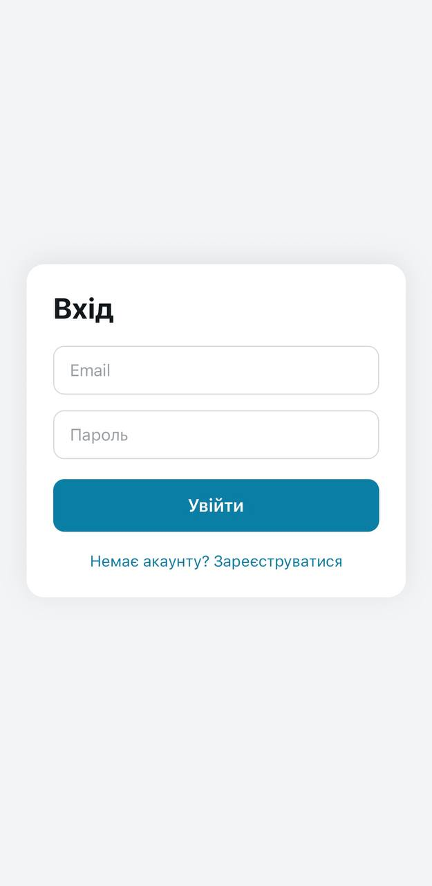
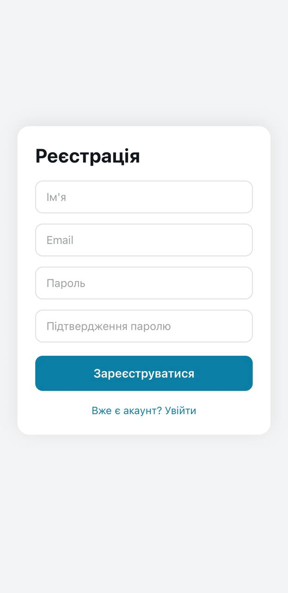
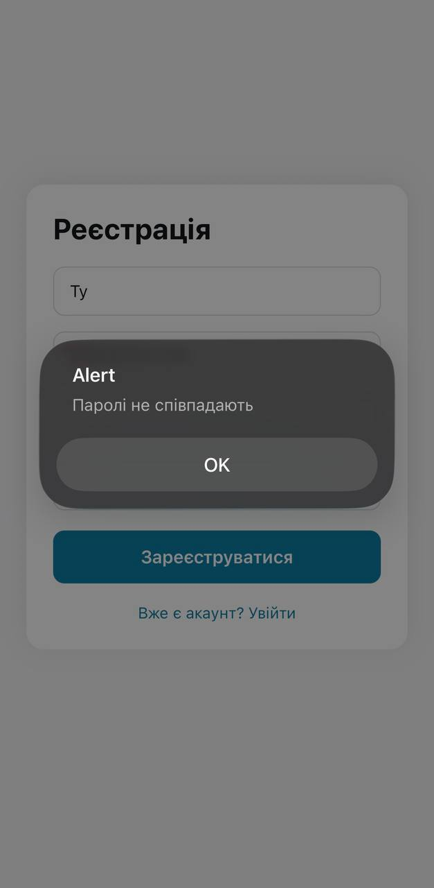
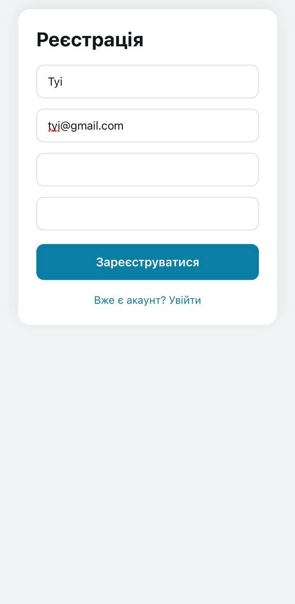

# Лабораторна робота №5 — Навігація у React Native з Expo Router

## 🚀 Інструкція запуску

1. Встановити залежності:
   ```bash
   npm install
   ```

2. Запустити застосунок:
   ```bash
   npx expo start
   ```

3. Відкрити у:
   - **Expo Go** (відскануйте QR-код)
   - **Android-емуляторі** — натисніть `a`
   - **iOS-симуляторі** — натисніть `i`
   - **Браузері** — натисніть `w`

---

## 📋 Опис реалізованого функціоналу

### Структура маршрутів (`/app`)

```
app/
├── _layout.tsx               ← Кореневий layout, обгортає AuthProvider
├── index.tsx                 ← Редирект на /login
├── +not-found.tsx            ← Екран 404
├── (auth)/
│   ├── _layout.tsx           ← Layout для публічних екранів
│   ├── login.tsx             ← Екран входу
│   └── register.tsx          ← Екран реєстрації
└── (app)/
    ├── _layout.tsx           ← Захищений layout (перевірка авторизації)
    ├── index.tsx             ← Каталог товарів
    └── details/
        └── [id].tsx          ← Деталі товару (динамічний маршрут)
```

### Реалізовані можливості

- **AuthContext** — глобальний контекст авторизації зі станом `isAuthenticated` та методами `login`, `register`, `logout`
- **Публічні екрани** — вхід (`/login`) та реєстрація (`/register`) у групі `(auth)`
- **Захищена навігація** — група `(app)` з перевіркою авторизації в `_layout.tsx`; неавторизований користувач автоматично перенаправляється на `/login`
- **Каталог товарів** — `FlatList` з 8 товарами у 2 колонки; кожна картка містить фото, назву та ціну
- **Динамічний маршрут** — `/details/[id]` відображає повну інформацію про товар за його `id`
- **404-екран** — `+not-found.tsx` з повідомленням і кнопкою повернення на головну

---

## 📸 Скріншоти






---

## Висновки (відповіді на контрольні запитання)

### 1. Як реалізується перенаправлення неавторизованого користувача?

У файлі `app/(app)/_layout.tsx` зчитується `isAuthenticated` з `AuthContext`. Якщо значення `false`, повертається компонент `<Redirect href="/login" />` з `expo-router`, який негайно перенаправляє користувача на екран входу ще до рендерингу захищеного вмісту.

### 2. Різниця між `<Link>` та `router.push()`?

`<Link>` — декларативний компонент, що рендериться безпосередньо в JSX і підходить для навігаційних елементів в UI (кнопки, пункти меню). `router.push()` — програмний метод, викликається в обробниках подій (наприклад, після успішної валідації форми або завершення асинхронної операції), коли навігація відбувається за певної логічної умови.

### 3. Як працюють динамічні маршрути та як отримати параметри?

Файл з ім'ям у квадратних дужках, наприклад `[id].tsx`, реєструє динамічний сегмент маршруту. Expo Router автоматично витягує значення сегмента і передає його через хук `useLocalSearchParams()`. У нашому випадку: `const { id } = useLocalSearchParams<{ id: string }>()` повертає `id` з URL `/details/3`.

### 4. Чому стан авторизації зберігається у React Context, а не в локальному стані?

Стан авторизації потрібен одразу кільком незалежним компонентам у різних частинах дерева: `_layout.tsx` у захищеній групі, кнопка «Вийти» в каталозі, екрани входу й реєстрації. Локальний стан (`useState`) існує лише в межах одного компонента. React Context слугує єдиним глобальним сховищем («single source of truth»), уникаючи prop drilling і забезпечуючи реактивне оновлення будь-якого підписаного компонента при зміні `isAuthenticated`.

### 5. Для чого використовуються групи маршрутів і як вони впливають на URL?

Групи маршрутів (папки у круглих дужках, наприклад `(auth)`, `(app)`) дозволяють логічно організувати файли проєкту та додати спільний `_layout.tsx` для набору екранів — без впливу на URL. Назва групи повністю ігнорується маршрутизатором: файл `app/(auth)/login.tsx` доступний за адресою `/login`, а не `/auth/login`.