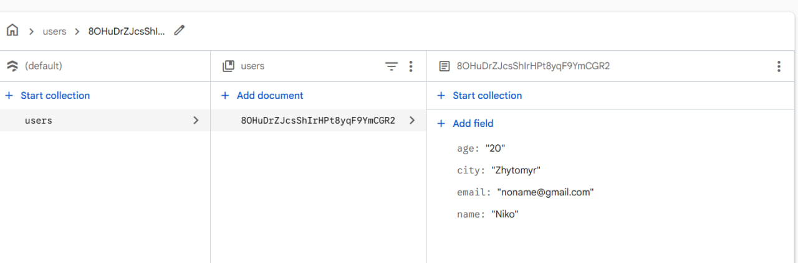
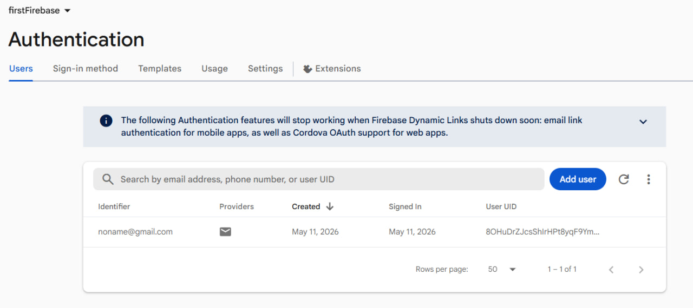
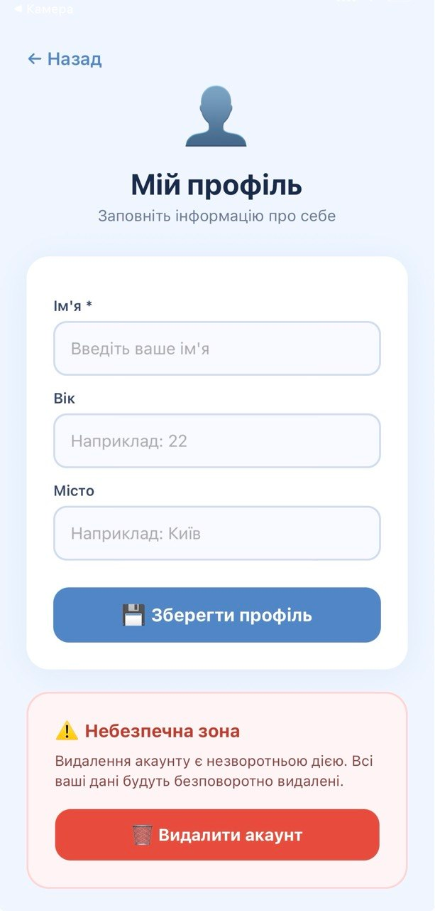
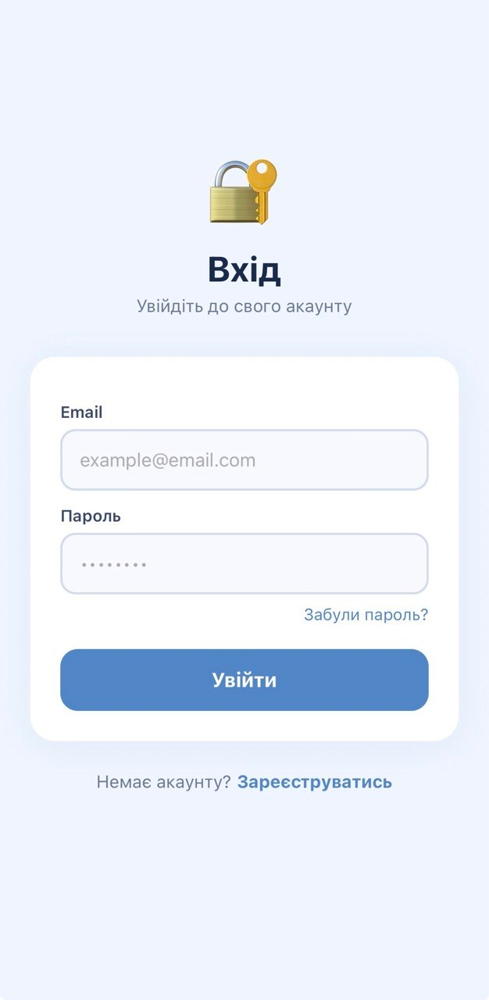

# 🔐 Lab 6 — Firebase Auth & Firestore у React Native

> Лабораторна робота №6 — Побудова авторизації та збереження персональних даних у React Native з використанням Firebase Authentication та Firestore

---

## 🚀 Інструкція запуску

### 1. Клонувати репозиторій

```bash
git clone https://github.com/MobileLabsRN2026/lab6.git
cd lab6
```

### 2. Встановити залежності

```bash
npm install
```

### 3. Налаштувати Firebase

1. Перейдіть до [Firebase Console](https://console.firebase.google.com/)
2. Створіть новий проект (або використайте існуючий)
3. Додайте **Web-застосунок** у налаштуваннях проекту
4. Увімкніть **Authentication → Email/Password** у розділі Sign-in method
5. Створіть базу даних **Firestore** (режим: production або test)
6. Скопіюйте конфіг та вставте у файл `config/firebase.ts`:

```ts
const firebaseConfig = {
  apiKey: "ВАШ_API_KEY",
  authDomain: "ВАШ_AUTH_DOMAIN",
  projectId: "ВАШ_PROJECT_ID",
  storageBucket: "ВАШ_STORAGE_BUCKET",
  messagingSenderId: "ВАШ_MESSAGING_SENDER_ID",
  appId: "ВАШ_APP_ID",
};
```

### 4. Встановити Firebase SDK

```bash
npm install firebase
```

### 5. Запустити застосунок

```bash
# Expo Go
npx expo start

# Android емулятор
npx expo start --android

# iOS симулятор
npx expo start --ios
```

---

## 🔒 Firestore Security Rules

Скопіюйте наступні правила у **Firestore → Rules**:

```
rules_version = '2';
service cloud.firestore {
  match /databases/{database}/documents {
    match /users/{userId} {
      allow read, write: if request.auth != null && request.auth.uid == userId;
      allow delete: if request.auth != null && request.auth.uid == userId;
    }
  }
}
```

---

## ✅ Реалізований функціонал

### 🔑 Авторизація
| Функція | Статус |
|---------|--------|
| Реєстрація за email та паролем | ✅ |
| Вхід існуючого користувача | ✅ |
| Вихід із системи | ✅ |
| Відновлення паролю через email | ✅ |

### 👤 Профіль користувача
| Функція | Статус |
|---------|--------|
| Заповнення профілю (ім'я, вік, місто) | ✅ |
| Збереження у Firestore (колекція `users`, документ = UID) | ✅ |
| Редагування профілю | ✅ |
| Відображення профілю на головному екрані | ✅ |

### 🛡️ Безпека
| Функція | Статус |
|---------|--------|
| Firestore Security Rules (uid-валідація) | ✅ |
| Клієнтська перевірка uid перед записом | ✅ |
| Захищена навігація `(auth)` / `(app)` | ✅ |
| Redirect для неавторизованих користувачів | ✅ |

### 🗑️ Управління акаунтом
| Функція | Статус |
|---------|--------|
| Видалення акаунту з підтвердженням | ✅ |
| Повторна автентифікація перед видаленням | ✅ |
| Видалення документа у Firestore при видаленні акаунту | ✅ |

---

## 🏗️ Структура проекту

```
lab6/
├── app/
│   ├── _layout.tsx              # Кореневий layout з AuthProvider
│   ├── index.tsx                # Redirect на основі стану авторизації
│   ├── (auth)/
│   │   ├── _layout.tsx          # Layout з захистом (redirect якщо авторизовано)
│   │   ├── login.tsx            # Екран входу
│   │   ├── register.tsx         # Екран реєстрації
│   │   └── forgot-password.tsx  # Відновлення паролю
│   └── (app)/
│       ├── _layout.tsx          # Layout з захистом (redirect якщо не авторизовано)
│       ├── home.tsx             # Головний екран
│       └── profile.tsx          # Редагування профілю + видалення акаунту
├── config/
│   └── firebase.ts              # Ініціалізація Firebase
└── context/
    └── auth-context.tsx         # AuthContext — централізований стан авторизації
```

---

## 📱 Скріншоти








---

## 🔄 Схема навігації

```
app/index.tsx
    │
    ├── user НЕ авторизований → (auth)/login
    │       ├── login.tsx
    │       ├── register.tsx
    │       └── forgot-password.tsx
    │
    └── user авторизований → (app)/home
            ├── home.tsx
            └── profile.tsx
```

---

## 🧩 Технічний стек

| Технологія | Використання |
|-----------|-------------|
| **React Native + Expo** | Основа мобільного застосунку |
| **Expo Router** | Файлова маршрутизація + захищені групи |
| **Firebase Authentication** | Реєстрація, вхід, скидання паролю, видалення акаунту |
| **Firebase Firestore** | Збереження та редагування даних профілю |
| **React Context API** | Централізоване управління станом авторизації |
| **TypeScript** | Типізація коду |

---

## 🔐 AuthContext — API

```ts
const {
  user,           // Firebase User | null
  profile,        // { name, age, city, email } | null
  loading,        // boolean — стан ініціалізації
  register,       // (email, password) => Promise<void>
  login,          // (email, password) => Promise<void>
  logout,         // () => Promise<void>
  saveProfile,    // ({ name, age, city }) => Promise<void>
  resetPassword,  // (email) => Promise<void>
  deleteAccount,  // (password) => Promise<void>
  refreshProfile, // () => Promise<void>
} = useAuth();
```

---

## 📝 Висновки

У ході виконання лабораторної роботи було розроблено повноцінний мобільний застосунок з аутентифікацією. Отримано практичні навички:

- **Firebase Authentication** — реалізовано повний цикл: реєстрація, вхід, вихід, скидання паролю та видалення акаунту з повторною автентифікацією (`reauthenticateWithCredential`).
- **Firebase Firestore** — налаштовано зберігання профілю у колекції `users` з UID як ідентифікатором документа. Реалізовано Security Rules, які забороняють доступ до чужих даних.
- **Expo Router** — освоєно файлову маршрутизацію з групами `(auth)` та `(app)`, а також використання `Redirect` у `_layout.tsx` для захисту маршрутів.
- **React Context API** — реалізовано `AuthContext` для централізованого управління станом авторизації, що спрощує доступ до даних користувача з будь-якого компонента.
- **UX/UI** — застосовано якісний дизайн екранів з обробкою помилок, індикаторами завантаження та підтвердженнями для деструктивних дій.